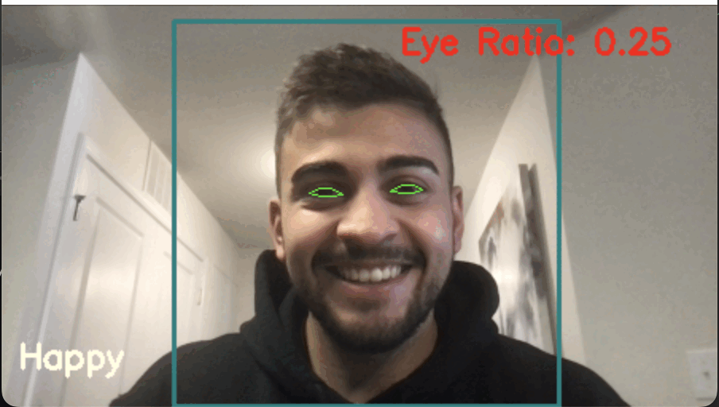

# Face-Expressions-Recognition

### Built With
![python-shield] ![open-cv] ![tensorflow]



**All the models explored are well documented with plots and performance metrics. [Here](https://github.com/Gama99/Facial-Expression-Recognition/blob/master/CNN.ipynb) it is.**

### Face-Expressions-Recognition

Train a facial expression classification model with the Keras TensorFlow library, read facial expressions from your webcam, adding facial landmarking to track your eyes to determine awareness!

<br> 

## Getting Started

### Prerequisites
Make sure you have installed TensorFlow, Dlib, Numpy, Scipy, IMutils, OpenCV, Pandas, Argparse, Scikitplot, Seaborn.

### Execution guide
1. Make sure the necessary prerequisites are installed on your system
2. Download or gitclone the repository

3. Type the following command inside the directory on your terminal
```
 python3 iEmotion.py -m <model_to_be_used>
```
You can load your on model in `/outputs/model` or selected one of the available ones, the available models performance and explanation can be accessed [Here](https://github.com/Gama99/Facial-Expression-Recognition/blob/master/CNN.ipynb)


## Contact
[![linkedin-shield]][linkedin]


<!-- Links -->

[python-shield]: https://img.shields.io/badge/-Python-blue?logo=python&logoColor=white&style=for-the-badge
[open-cv]: https://img.shields.io/badge/-OpenCV-red?logo=opencv&logoColor=white&style=for-the-badge
[flask]: https://img.shields.io/badge/-Flask-black?logo=flask&logoColor=white&style=for-the-badge
[html-shield]: https://img.shields.io/badge/-HTML-orange?logo=html5&logoColor=white&style=for-the-badge
[css-shield]: https://img.shields.io/badge/-CSS-2862E9?logo=css3&logoColor=white&style=for-the-badge
[linkedin-shield]: https://img.shields.io/badge/-linkedin-0078B6?logo=linkedin&logoColor=white&style=for-the-badge
[linkedin]:https://www.linkedin.com/in/apollogama/
[tensorflow]:https://img.shields.io/badge/TensorFlow-FF6F00?style=for-the-badge&logo=tensorflow&logoColor=white
